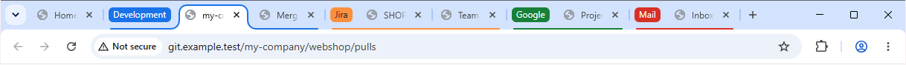
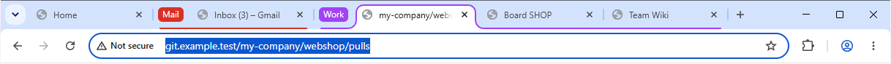
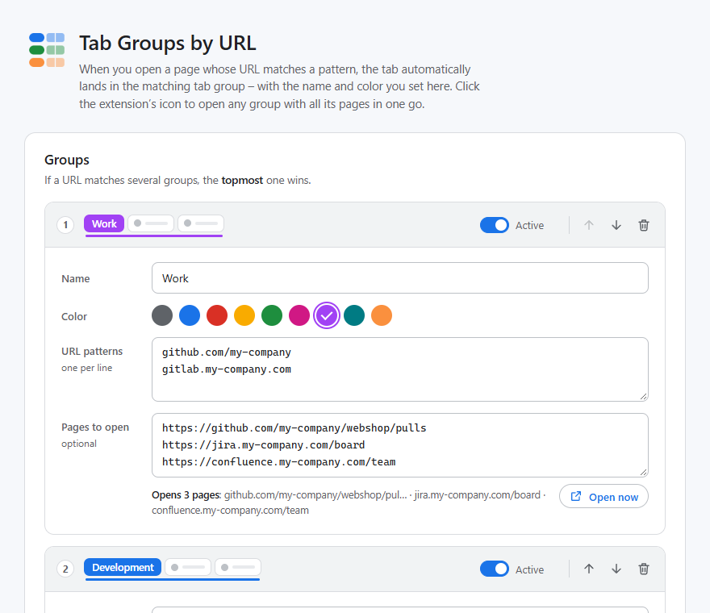
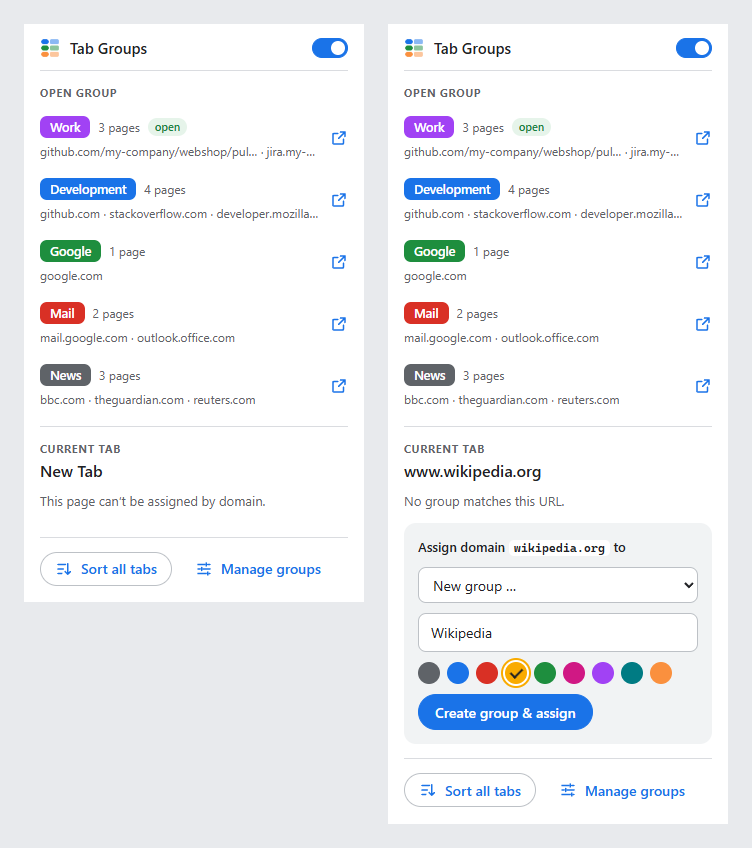

# Tab Groups by URL

Chrome extension: when you open a page whose URL matches a pattern, the tab automatically lands in a predefined **tab group – with name and color**. You can also open any group with all its pages **in one click**.



## Installation

1. Clone this repository – `git clone https://github.com/chrssng/chrome-tab-groups.git` – or [download it as a ZIP](https://github.com/chrssng/chrome-tab-groups/archive/refs/heads/master.zip) and unpack it.
2. Open `chrome://extensions` in Chrome.
3. Turn on **Developer mode** in the top right corner.
4. Click **Load unpacked** and select the **`extension`** folder.
5. The settings page opens automatically. Tip: pin the extension via the puzzle icon in the toolbar.

**Updating to a new version:** run `git pull` in your clone – or, if you downloaded the ZIP, replace the files in your *existing* `extension` folder with the new ones. Then click ⟳ (Reload) on the extension's entry at `chrome://extensions` – your groups are kept. If you load the new version from a different folder instead, Chrome treats it as a different extension and your groups are missing; in that case, **Export** them in the settings first and **Import** them afterwards.

After changing the code, click ⟳ the same way.

## Setting up groups

Open the settings: right-click the icon → **Options** – or click **Manage groups** in the popup.

For each group you set:

- **Name** – what the group is called in the tab strip
- **Color** – one of the nine colors Chrome offers for groups
- **URL patterns** – one per line (see below)
- **Pages to open** (optional) – the pages that “Open group” loads
- **Active/Paused** and the **order** (↑ ↓) – if a URL matches several groups, the topmost one wins

Everything takes effect when you click **Save** (or press <kbd>Ctrl</kbd>+<kbd>S</kbd>). Under “Test a URL” you can see right away which group a URL would land in.

**Shortcut:** on any page, click the extension's icon → “Assign domain … to” → choose an existing group, or create a new one with name and color right there.

## Open a group in one click

Click the extension's icon → under **Open group**, click the group. All of its pages open in the current window as a tab group – with name and color. In the settings, every group also has an **Open now** button for this.

- **Which pages?** The URLs under “Pages to open”, one per line, e.g. `https://github.com/my-company/webshop/pulls`. If that field is empty, the URL patterns that are concrete URLs are opened (`github.com` → `https://github.com/`); patterns with `*`, regular expressions and exclusions are skipped. Below the field you can always see what would be opened.
- **Without a scheme**, `https://` is added – or `http://` for `localhost`, IP addresses, names without a dot and URLs with a port.
- **Empty tab:** if the active tab is an empty “New Tab”, it is used for the first page.
- **No duplicates:** if the group is already open in the window, only the missing pages are added. A page also counts as open if its tab has moved on to a subpage in the meantime. The popup then shows “open” next to the group.
- **Redirects:** freshly opened tabs stay in their group for the first 30 seconds, even if the page redirects, e.g. to a login page or to a URL that belongs to another group.
- **Paused** groups can be opened too – handy for pure “starter sets” that shouldn't sort tabs automatically.







## URL patterns

| Pattern | Matches |
|---|---|
| `github.com` | github.com and all subdomains (www., gist., …), any path |
| `*.atlassian.net` | same as `atlassian.net` |
| `github.com/my-company` | only URLs that start with this path |
| `github.com/*/issues` | `*` stands for any number of characters |
| `localhost:3000` | only this port |
| `https://intranet.example.com/wiki` | with scheme – `http://` doesn't match then |
| `/\.pdf$/i` | regular expression, tested against the full URL |
| `!mail.google.com` | exclusion: if the URL matches it, the group is skipped |
| `# note` | comment, ignored |

Matching is case-insensitive, and a leading `www.` is ignored. Patterns (except regular expressions) match the beginning of the URL – anything after that matches automatically.

Example “everything from Google except Gmail”: a group *Google* with `google.com` and `!mail.google.com`, plus a separate group *Mail* with `mail.google.com`.

## How the extension behaves

- **When?** Whenever a tab gets a new URL: new tab, link, typing in the address bar, and also page changes inside web apps.
- **Per window:** if the window already has a group with that name, the tab goes into it. Otherwise the group is created with its name and color. Even many tabs opened at the same time end up in *one* group.
- **You stay in control:** if you drag a tab out of its group by hand, the extension won't pull it back as long as you stay on pages of the same group. Only when the tab moves on to a URL of a *different* group is it assigned again.
- **Tabs that are left alone:** pinned tabs, the New Tab page and pop-up windows are never touched. If no rule matches, the tab stays where it is.
- **Leaving a group:** optionally (“Remove a tab from its group when it leaves the group”), a tab is taken out of its group as soon as it navigates to a URL without a matching rule. Groups you created yourself are left untouched.
- **Renaming/recoloring** a group in the settings immediately applies to groups that are already open.
- **Sort all tabs now** (popup or settings) also sorts tabs that were already open.
- **Pausing:** use the switch at the top of the popup. The icon then shows “off”. “Open group” still works.
- **Backup:** the settings are stored in `chrome.storage.sync` and follow your Google account if Chrome sync is turned on for extensions. There's also export/import as JSON.

## Permissions

| Permission | Used for |
|---|---|
| `tabs` | reading the tabs' URLs. Chrome describes this as “Read your browsing history” – but the extension doesn't store any history and doesn't send anything to the internet. |
| `tabGroups` | creating, naming and coloring groups |
| `storage` | saving the settings |

## Notes

- Depending on the version, Chrome keeps tab groups as “saved groups”. If you only hide a group and later open a matching page again, the extension creates a new group with the same name – it can't reopen hidden groups because Chrome offers extensions no API for that. So it's better to delete groups you no longer need instead of hiding them.
- If you rename a group directly in the tab strip, it no longer counts as “its” group – the next matching tab then lands in a new group with the name from the settings.

## Development

```
extension/            ← load this folder in Chrome
  manifest.json       Manifest V3
  background.js       service worker: watches tabs, groups them
  lib/patterns.js     URL patterns and URLs to open (no chrome.* – also testable in Node)
  lib/config.js       loading/saving/validating the settings
  lib/colors.js       the nine Chrome group colors
  options.html        settings page (ui/options.js, ui/options.css)
  popup.html          popup with “Open group” (ui/popup.js, ui/popup.css)
  ui/shared.css       shared styles, light/dark
tests/
  patterns.test.mjs   unit tests for the pattern logic
  e2e.mjs             end-to-end test in a real Chromium
```

No build step, no runtime dependencies – plain JavaScript (ES modules).

```bash
npm test                          # unit tests (Node 20+)
npm install                       # only needed for the E2E test (Playwright)
npx playwright install chromium
npm run test:e2e                  # 66 checks in a real Chromium, no internet needed
```

Debugging: on `chrome://extensions`, click **Service Worker** on the extension's entry – this opens DevTools for `background.js`.

## License

[MIT](LICENSE)
