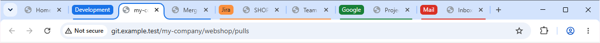

# Tab Groups by URL – Documentation

Tab Groups by URL is a Chrome extension that sorts tabs into predefined tab groups – with name and color – based on their URL, and opens any group with all its pages in one click.



For installation, see the [main README](../README.md#installation).

## Features

| Page | What it covers |
|---|---|
| [Automatic grouping](automatic-grouping.md) | When a tab is moved into a group, when it's left alone, pausing, sorting tabs that are already open |
| [URL patterns](url-patterns.md) | The full pattern syntax: domains, paths, ports, schemes, wildcards, regular expressions, exclusions, priority |
| [Open a group in one click](open-group.md) | Opening all pages of a group as a tab group, without duplicates – or a whole category; expanded or collapsed |
| [The popup](popup.md) | Everything behind the toolbar icon: on/off switch, “Open group”, current tab, assigning a domain |
| [The settings page](settings.md) | Editing groups, errors and hints, testing a URL, behavior options, saving |
| [Categories](categories.md) | Sorting groups into categories, the “Default” category, priority, the category in the tab title, collapsing |
| [Backup, sync & import](backup-and-sync.md) | Chrome sync, export/import as JSON, the file format, the sample file, resetting everything |
| [Permissions & privacy](privacy.md) | What the extension may do, what it stores, what it doesn't |
| [Troubleshooting](troubleshooting.md) | Common problems and known limitations |

## Quick start

1. Install the extension – the settings page opens automatically.
2. Click **Add group** – it goes into the category *Default* – enter a name (e.g. *Development*), pick a color and add URL patterns, one per line:
   ```
   github.com
   stackoverflow.com
   localhost:3000
   ```
3. Click **Save** (or press <kbd>Ctrl</kbd>+<kbd>S</kbd>).
4. Open `https://github.com` – the tab lands in a blue *Development* group.

Want to see everything in action without typing? **Import** [`tests/sample-groups.json`](../tests/sample-groups.json) in the settings – see [Sample file](backup-and-sync.md#sample-file).

## Terms used in these pages

- **Group** – a group you configure in the settings: name, category, color, URL patterns, pages to open.
- **Category** – a section of the list that groups belong to, e.g. *Work*. There is always at least one; at first it's *Default*.
- **Tab group** – Chrome's group in the tab strip. The extension creates one per group and window, and recognizes it by its title – the group's name, or *Category · Name*.
- **Pattern** – a line under “URL patterns” that decides which URLs belong to a group.
- **Pages to open** – the concrete URLs that “Open group” loads.
