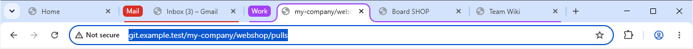

[← Documentation](README.md)

# Open a group in one click

Every group can open all of its pages at once – as a tab group with its name and color. A whole [category](categories.md) can be opened the same way.



## How to open a group

- **Popup:** click the extension's icon → under **Open group**, click the group. Once the group is open, the popup closes. See [The popup](popup.md#open-group).
- **Settings:** click **Open now** below a group's “Pages to open”. Unsaved changes are saved first.

### Opening a whole category

- **Settings:** **Open all** in the category's header. Unsaved changes are saved first.
- **Popup:** **Open all** next to the category's heading (shown if your groups are spread over several categories and the category has more than one group to open).

All groups of the category that have something to open are opened one after another, in the order of the list – paused groups too. The first group's first page becomes the active tab. Groups that are already open only get their missing pages, as usual.

## Which pages are opened

The URLs under **Pages to open**, one per line, e.g.:

```
https://github.com/my-company/webshop/pulls
https://jira.my-company.com/board
https://confluence.my-company.com/team
```

Blank lines and lines starting with `#` are ignored.

**If “Pages to open” is empty**, the group's URL patterns are used instead – but only those that are concrete URLs:

| URL pattern | Opens |
|---|---|
| `github.com` | `https://github.com/` |
| `gitlab.com/*` | `https://gitlab.com/` (a trailing `*` is dropped) |
| `https://a.example.com/wiki` | `https://a.example.com/wiki` |
| `*.atlassian.net` | – (wildcard) |
| `/\.pdf$/i` | – (regular expression) |
| `!mail.google.com` | – (exclusion) |

Below the field, the settings page always shows what would be opened, e.g. **Opens 3 pages:** github.com/my-company/webshop/pul… · jira.my-company.com/board · …

### Rules for “Pages to open”

- **Without a scheme**, one is added:

  | Entry | Opens |
  |---|---|
  | `example.com` | `https://example.com/` |
  | `localhost/dashboard` | `http://localhost/dashboard` |
  | `192.168.0.1` | `http://192.168.0.1/` |
  | `intranet/wiki` (no dot) | `http://intranet/wiki` |
  | `example.com:8080` (port) | `http://example.com:8080/` |

- Allowed schemes: `http`, `https`, `file` and `chrome` (e.g. `chrome://extensions`).
- Not allowed – marked as an error, blocks saving: wildcards (`*`), regular expressions, exclusions, spaces, other schemes such as `ftp://`, and URLs with user name/password.

## Where the pages open

- **Window:** the window you opened the popup (or the settings page) in. If no normal browser window is open, a new window is created.
- **Empty tab:** if the active tab is an empty New Tab page, it's used for the first page.
- **Focus:** the new tabs open in the background and are grouped; then the group is expanded and its first new page becomes the active tab.
- **Position:** a new tab group is added at the end of the tab strip.

### Opening groups in list order

Settings → Behavior → **Open groups in list order** (off by default).

When it's on, a new tab group is placed according to the order of your list instead – across all categories, as shown in the settings: right after the last open group that comes *before* it in the list – or, if there is none, right before the first one that comes *after* it. Tab groups that are already open aren't moved, and tab groups the extension doesn't manage are ignored.

Example: your list is *Work*, *Development*, *Mail*. *Work* and *Mail* are open. Opening *Development* puts it between them.

## No duplicates

If the window already has the group's tab group – same title, and for [groups with the same title](categories.md#groups-with-the-same-title) the one the extension created for it – only the **missing** pages are added. If all pages are already open, the group's first tab is shown.

A page counts as open if a tab in that tab group is

- on exactly that URL – ignoring `#fragment`, a trailing slash and upper/lower case, or
- on a subpage of it, e.g. after a redirect from `/board` to `/board/login`.

Each tab counts for only one page. The popup shows **open** next to groups that are already open in the current window.

## Redirects

Freshly opened tabs stay in their group for the first **30 seconds**, even if the page redirects – e.g. to a login page, or to a URL that belongs to another group. After that, normal [automatic grouping](automatic-grouping.md) applies again.

## Paused groups and starter sets

Paused groups can be opened too, and so can every group while automatic grouping is paused.

This makes **starter sets** possible: a group with only “Pages to open” and no URL patterns, e.g. your morning news. Pause it to make clear that it never sorts tabs on its own. The [sample file](backup-and-sync.md#sample-file) contains one (*News*).

## When something goes wrong

- A group without any page to open isn't listed in the popup; in the settings, **Open now** is disabled and the preview says *Nothing to open*. **Open all** of a category is disabled if none of its groups has anything to open.
- If single pages can't be opened, the others still open, and you get a message like *2 pages opened – could not open: …*.
