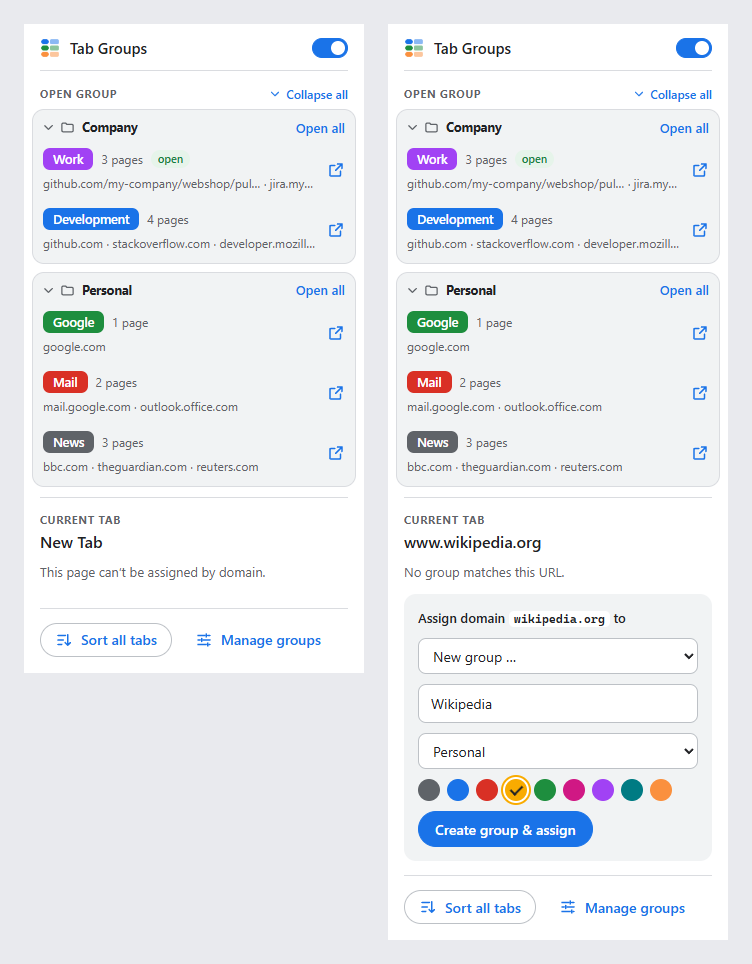

[← Documentation](README.md)

# The popup

Click the extension's icon in the toolbar. Tip: pin the extension via the puzzle icon so it's always visible.

## On/off switch

The switch at the top right turns [automatic grouping](automatic-grouping.md) on and off. It takes effect immediately – no saving needed.

While it's off, the popup shows *Paused – tabs are only sorted when you click a button*, and the toolbar icon shows the badge **off**. “Open group”, “Sort all tabs” and “move it there” keep working.

## Open group

Every group that has a name and at least one page to open is listed here. Click a row to [open the group](open-group.md) in the current window – collapsed, if the group is set to [Open collapsed](open-group.md#collapsed-tab-groups).

If these groups are spread over several [categories](categories.md), each category is shown as its own block – with a folder icon and the category's name, and its groups inside. **Open all** next to the name opens all groups of that category at once – expanded, or collapsed if the category is set to [Open all collapsed](open-group.md#collapsed-tab-groups). See [Opening a whole category](open-group.md#opening-a-whole-category). It's shown for categories with more than one group.

Click a category's name to collapse or expand its block – handy for categories you rarely open. **Collapse all** next to “Open group” collapses all categories at once – or, if all are collapsed, it reads **Expand all**. A collapsed block shows how many groups it contains, and **Open all** keeps working. The popup remembers which categories are collapsed (only on this computer, and separately from the settings page).

Each row shows:

- the group's title in its color – with the category in front, if the group [shows it in the tab title](categories.md#the-category-in-the-tab-title)
- how many pages it opens, and a short list of them – hover over the row for the full URLs
- **open** – the group is already open in this window; clicking adds only the missing pages
- **paused** – the group doesn't sort tabs automatically, but can still be opened

## Current tab

Shows the domain of the active tab and its status:

| Status | Meaning |
|---|---|
| **Belongs to** *Group* **via** `pattern` | This group matches, through this pattern. With several categories, the group's category is shown too: **Belongs to** *Group* **in** *Category* **via** `pattern` – unless the group's title already contains it. |
| **Not in the group right now – move it there** | The tab matches a group but isn't in it (e.g. you dragged it out). Click to move it – this works even while paused. |
| *No group matches this URL.* | You can assign the domain right below. |
| *This page can't be assigned by domain.* | Not a web page – e.g. the New Tab page, `chrome://` pages or local files. |
| *Pinned tabs are never grouped.* | The tab is pinned. |

## Assign a domain

On web pages, the popup offers **Assign domain `example.com` to** – the fastest way to create a rule without opening the settings.

The suggested pattern is the page's domain without `www.` (with the port, if there is one): on `https://www.github.com:8443/x` it's `github.com:8443`.

1. Choose an existing group – paused ones are marked *(paused)*; with several categories, the list is sorted by category – or **New group …**.
2. For a new group, a name is suggested from the domain (`mail.google.com` → *Google*) and the first unused color is preselected. Adjust both if you like. If you have several categories, choose one as well: preselected is the category of the group that catches the page right now (so the new group can be placed above it), otherwise the first category. The name has to be unique within the category.
3. Click **Assign** (or **Create group & assign**).

What happens:

- The pattern is added to the chosen group. The same domain is **removed from all other groups** – also in equivalent spellings like `*.example.com`, `www.example.com` or `example.com/` – so the domain really *moves*.
- If the chosen group was paused, it becomes active.
- If a group further up would still win (e.g. *Google* with `google.com` above the group you assigned `mail.google.com` to), the chosen group is moved right above it – as long as both are in the same category.
- The change is **saved immediately** and the current tab is sorted into the group.

You get a warning if the assignment still doesn't take effect: *Saved, but “…” further up still wins* – the winning group is in a category above; move the group there, or move its category up, in the settings. Or an exclusion pattern in the chosen group prevents it. If the domain already belongs to the chosen group, the button reads **Already assigned**.

## Buttons at the bottom

- **Sort all tabs** – sorts all tabs that are already open, in all windows. See [Sorting tabs that are already open](automatic-grouping.md#sorting-tabs-that-are-already-open).
- **Manage groups** – opens the [settings page](settings.md).
