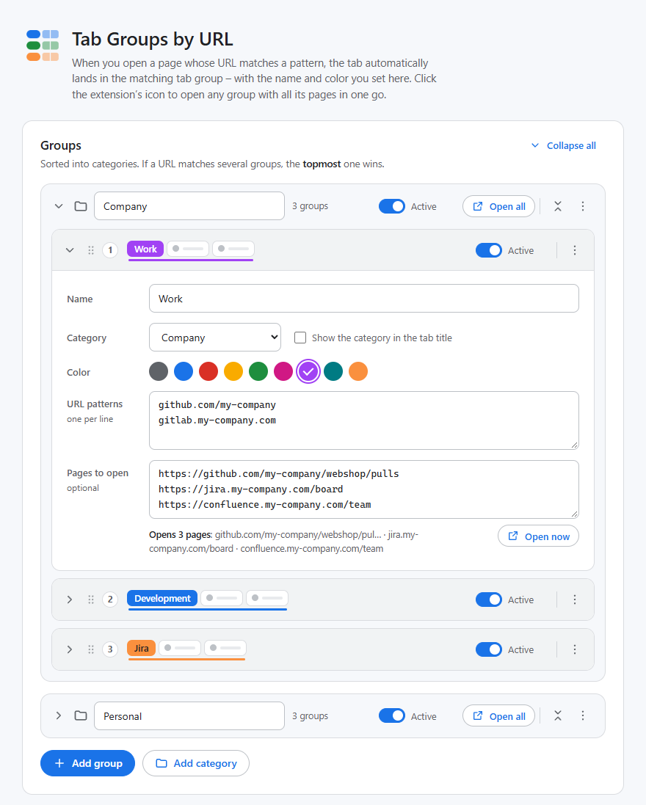

[← Documentation](README.md)

# The settings page

Open it with a right-click on the extension's icon → **Options**, or with **Manage groups** in the [popup](popup.md). After installing, it opens automatically.

## Groups

The groups are listed in their [categories](categories.md) – every category is a tinted frame, marked with a folder icon, that contains its groups. Its header has ⌄ to collapse it, the name, an on/off switch for all its groups, **Open all**, ⇕ to collapse all its groups, and the ⋮ menu to add a group, move or delete the category, and to choose whether **Open all** creates its tab groups collapsed. There is always at least one category; at first it's **Default**.

Each group is a card. Its header shows:

- ⌄ to collapse or expand the card
- the **priority** (1 = checked first – see [Which group wins](url-patterns.md#which-group-wins))
- a **preview** of the tab group in its color, with its title in the tab strip
- the **Active/Paused** switch
- ⋮ – a menu with **Move up** / **Move down** (within the category), the switch **Open collapsed** (**Open now** and the popup create the tab group collapsed – see [Collapsed tab groups](open-group.md#collapsed-tab-groups)) and **Delete group**. It works like the [category's menu](categories.md#managing-categories), also with the keyboard.

To change the order, you can also **drag a card by its header** – within its category or onto another one. Press <kbd>Esc</kbd> while dragging to cancel.

The fields:

| Field | |
|---|---|
| **Name** | The title of the tab group in the tab strip. Required, at most 60 characters, unique within its category (upper/lower case doesn't count). |
| **Category** | The category the group belongs to. **Show the category in the tab title** (off by default) titles the tab group *Category · Name*. See [Categories](categories.md). |
| **Color** | One of the nine colors Chrome offers for tab groups: grey, blue, red, yellow, green, pink, purple, cyan, orange. |
| **URL patterns** | One per line – see [URL patterns](url-patterns.md). |
| **Pages to open** | Optional, one URL per line – see [Open a group in one click](open-group.md). Below the field you see what would be opened, and the **Open now** button. |

**Add group** below the list appends a new card to the last category – with the first color no other group uses yet. **Add group** in the ⋮ menu of a category's header adds it to that category instead. **Add category** appends a new category.

**Delete group** in a group's ⋮ menu removes it from the list. Until you save, **Discard** brings it back. What happens when you delete a category: see [Managing categories](categories.md#managing-categories).

### Collapsing

With many groups, collapse what you don't need right now: a single group or category with ⌄ in its header, all groups of a category with ⇕ in the category's header, or all categories with **Collapse all** / **Expand all** at the top right of the list. This is only a view setting for this computer – see [Collapsing](categories.md#collapsing).

## Errors and hints

The page checks everything while you type.

**Errors** (red) block saving:

- a group without a name
- a name that already exists in the same category
- a category without a name, or with a name that already exists
- a URL pattern that can't be read – shown with its line number, e.g. *Line 2 “example.com/a b”: Patterns must not contain spaces.* See [Errors](url-patterns.md#errors).
- a line under “Pages to open” that isn't a concrete URL

**Hints** (yellow) don't block anything:

- *No URL pattern yet – tabs will never be added to this group automatically.* (Not shown if the group has pages to open – it's then a starter set.)
- *“…” is already caught by “…” further up* – a pattern that can never win because of a group above. Move the group up, or add an exclusion to the other one.
- *The group “…” in “…” has the same title in the tab strip* – a group with the same name in another category. See [Groups with the same title](categories.md#groups-with-the-same-title).

A group with errors gets a red border – also while it's collapsed.

## Saving

As soon as something changed, a bar with **Save** and **Discard** appears at the bottom.

- **Save** – or <kbd>Ctrl</kbd>+<kbd>S</kbd> (<kbd>⌘</kbd>+<kbd>S</kbd> on a Mac). If there are errors, nothing is saved and the first error gets the focus – its category and group are expanded if they were collapsed.
- **Discard** – back to the last saved state.
- Leaving the page with unsaved changes makes Chrome ask first.

Changes take effect immediately after saving. Tab groups that are already open are renamed and recolored to match – also when you rename a category they show in their title – see [Renaming and recoloring](automatic-grouping.md#renaming-and-recoloring). New patterns apply to the next navigation; use **Sort all tabs now** for tabs that are already open.

If saving fails because of Chrome sync's size limits, you get an explanation – see [Chrome sync](backup-and-sync.md#chrome-sync).

### Changes from elsewhere

The settings can also change while the page is open – through the popup (“Assign domain”, on/off switch) or via Chrome sync from another device.

- Without unsaved changes, the page simply reloads the new state.
- With unsaved changes, a banner appears: *The settings have been changed elsewhere in the meantime.* **Reload** loads the new state and drops your changes; alternatively, save to overwrite.

## Test a URL

Type or paste a URL and see immediately where it would go – **including unsaved changes**. If you leave out the scheme, `https://` is assumed.

Possible results:

- **Goes to** *Group* **via the pattern** `…` – with the group's category in brackets, unless it's already part of the title
- *No group matches – the tab stays where it is.*
- *Skipped: “…” because of the exclusion `…`* – a group above matched but was skipped because of an exclusion.
- *Would also match “…”, but that group is paused.*
- *That is not a valid URL.*

## Behavior

| Option | Default | |
|---|---|---|
| **Group tabs automatically** | on | Off = tabs are only sorted when you click a button. The same switch is at the top of the popup. See [Pausing](automatic-grouping.md#pausing). |
| **Remove a tab from its group when it leaves the group** | off | See [Removing a tab when it leaves its group](automatic-grouping.md#removing-a-tab-when-it-leaves-its-group). |
| **Open groups in list order** | off | See [Opening groups in list order](open-group.md#opening-groups-in-list-order). |

These options are saved together with the groups via **Save**.

**Sort all tabs now** sorts all tabs that are already open, in all windows, according to the saved rules. Unsaved changes are saved first.

## How to write URL patterns

A collapsible cheat sheet with the pattern syntax and the rules for “Pages to open” – the short version of [URL patterns](url-patterns.md).

## Back up, transfer & reset

**Export** and **Import …** – see [Backup, sync & import](backup-and-sync.md). **Reset …** starts over from scratch – see [Reset](backup-and-sync.md#reset).
